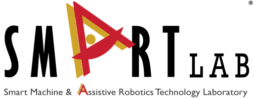

Hi! I am Dayoon Suh.

I am an incoming Robotics MSE student at University of Pennsylvania. Prior to my MSE, I was an undergraduate at Purdue University, where I double majored Data Science and Applied Statistics. During my undergraduate studies, I was advised by Prof. Byung-Cheol Min. 
My research interests lie in building intelligent systems that can perceive, reason, and interact with their surroundings in a human-like manner. I’m particularly passionate about robot perception, multimodal learning, and embodied AI.
<!-- I am a undergraduate student majoring in Data Science and Applied Statistics at Purdue University, advised by Prof. Byung-Cheol Min. 
My primary research interests lie in the intersection of computer vision, multimodal learning, and robot perception. Particularly, I am interested in enabling robots to perceive, reason, and interact with their surroundings in a human-like manner. In general, I am excited about the potential applications of AI in solving real-world problems. -->

<!-- Affiliations Section -->

  <!-- 
Affiliations:
 -->
  
  
  
  

