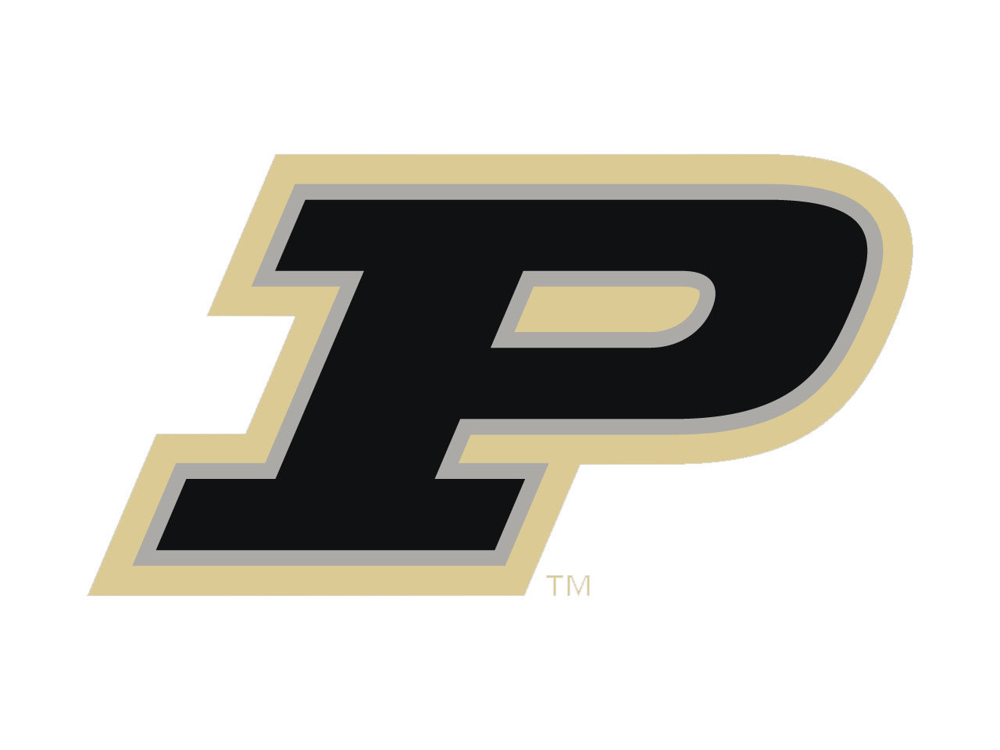

Hi! I am Dayoon Suh.

I am a undergraduate student majoring in Data Science and Applied Statistics at Purdue University. 
My primary research interests are computer vision, multimodal learning, and robotics. I am excited about the potential applications of AI in solving real-world problems.

I am a big fan of ice cream and chocolate. 

<!-- Affiliations Section -->

  <!-- 
Affiliations:
 -->
  
  
  

